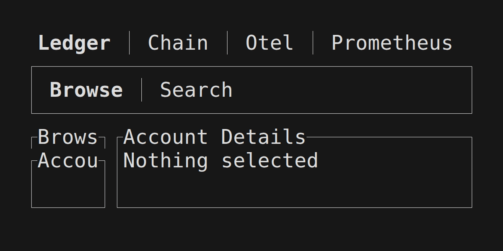

# amaru-doctor

A TUI for amaru

# Usage

First you will need to compile locally the `amaru-doctor` binary:

```shell
git clone https://github.com/jeluard/amaru-doctor
cd amaru-doctor
cargo install --path .
```

You can now run with `AMARU_LEDGER_DB=path/to/ledger.db AMARU_CHAIN_DB=path/to/chain.db amaru-doctor`



Thanks to @geofflittle for the contributions.