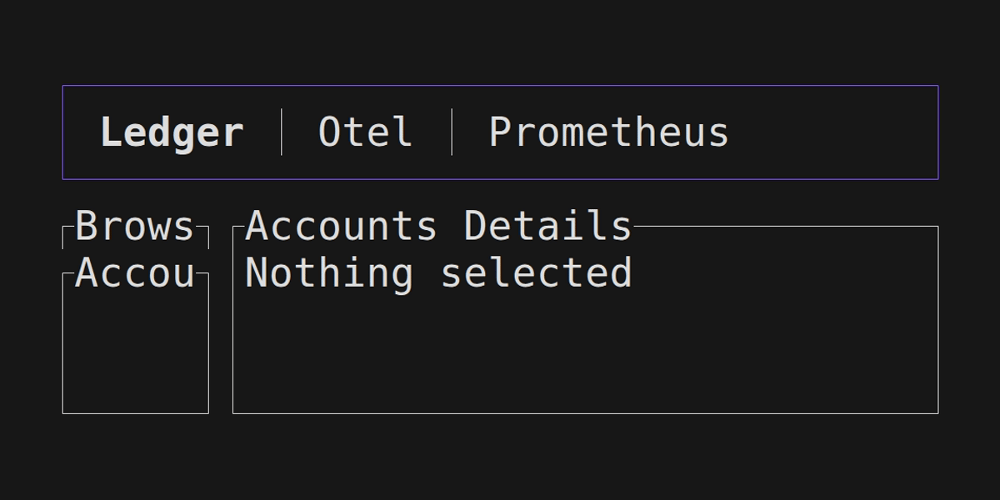

# amaru-doctor

A TUI for amaru

# Usage

First you will need to compile locally the `amaru-doctor` binary:

```shell
git clone https://github.com/jeluard/amaru-doctor
cd amaru-doctor
cargo install --path .
```

You can now run with `AMARU_LEDGER_DB=path/to/ledger.db AMARU_CHAIN_DB=path/to/chain.db amaru-doctor`



## Mouse Support

The application now supports comprehensive mouse interactions:

- **Click to Focus**: Click on any widget to focus it (equivalent to keyboard navigation)
- **Mouse Wheel Scrolling**: Use mouse wheel to scroll through lists and content
- **Drag to Scroll**: Click and drag to scroll through views (drag down to scroll content up, drag up to scroll content down)
- **Mouse Movement**: Mouse movement is tracked for potential hover effects
- **Automatic Mouse Capture**: Mouse support is enabled by default

The mouse handling follows ratatui best practices and integrates seamlessly with the existing keyboard-based focus and scroll systems.

Thanks to @geofflittle for the contributions.